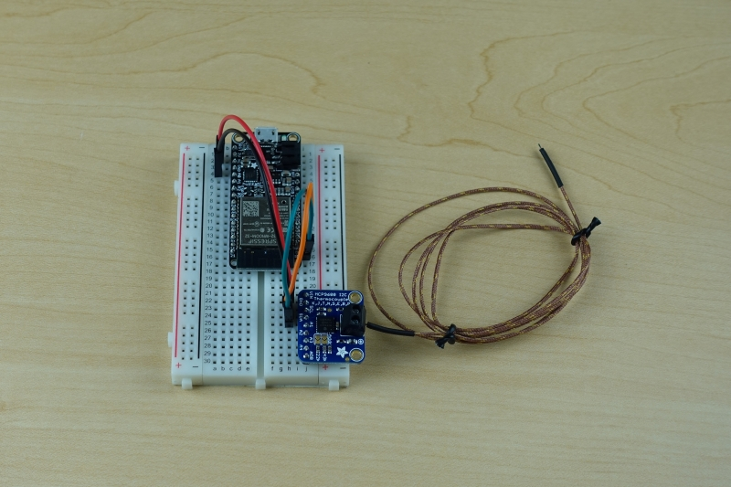
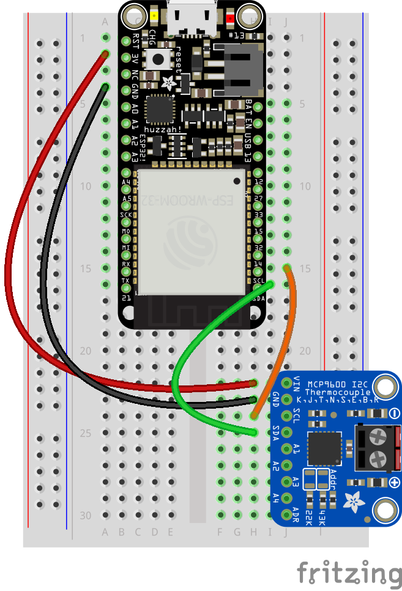

# Scientific Freezer Temperature Monitor
This tutorial covers everything you'll need to build and run your own freezer temperature monitor and alert system. We'll cover how to build the device, setting up a free online database, flashing code onto the device, monitoring the database and sending email alerts.

## Materials and Tech  
|Tech | Description | Link |
|-----|-------------|------|
| ESP32 DevKit (a) | WiFi enabled prototyping board| https://www.keyestudio.com/products/2019new-keyestudio-esp32-wroom-32d-module-core-board-wi-fibtble-mcu-for-arduino
| Adafruit MCP9600 (b) | I2C Thermocouple amplifier| https://www.adafruit.com/product/4101
| Adafruit Type K Thermocouple (c) | 2 wire thermocouple effective temperature ranger -200c to 800c +/-2c| https://www.adafruit.com/product/3245
| AdafruitIO | Online database | adafruit.io|
| IFTTT | Online automation platform | http://ifttt.com

| Material/Tools |
|----------|
| Jumper Wires (d) |
| Breadboard (e) |
| 00 Philips Head Screw Driver|
| Soldering Iron |


## Prerequisites

1. AdafruitIO account, you can sign up for free account [here](https://accounts.adafruit.com/users/sign_up)  
1. IFTTT Account, you can join IFTTT [here](https://ifttt.com/join)

## Build

1. Solder the screw terminal to the top side of your MCP9600.
    
1. Solder the pins to the bottom side of the MCP9600.  
    > *Tip: Put the pins in the breadboard to hold them in place when soldering.*
    
1. Connect the ESP32 and MCP9600 to the breadboard.
1. Follow the wiring diagram below to connect the MCP9600 to the ESP32 using your jumper wires.
    
1. Connect the Thermocouple to the screw terminals on the MCP9600
    

## Code

You'll need to update the config.h file with your AdafruitIO and WiFi credentials.

1. Find your Adafruit IO credentials in the top right corner of the Adafruit IO webpage. 
    

1. Copy and paste them in here.
    >*Remember to treat your key like a password*
    ```C++
    #define IO_USERNAME "your_username"
    #define IO_KEY "your_key"
    ```
1. Next you will need to add the WiFi SSID, or network name, and the password. Note: The code doesn't support WiFi networks that use a captive portal.
    ```C++
    #define WIFI_SSID "your_ssid"
    #define WIFI_PASS "your_pass"
    ```

1. Open *FreezerTempAlert.ino* and change the threshold temperature to the temperature you wanted to be alerted at. The default temperature is -50c.
    ```C++
    // Set the temperature you want to be alerted at
    const float thresholdTemperature = -50;
    ```

## Flashing the code

1. Follow the first section of this [guide](https://randomnerdtutorials.com/installing-the-esp32-board-in-arduino-ide-windows-instructions/) to add the ESP32 extension to the Arduino IDE.

1. With FreezerTempAlert.ino open in the Arduino IDE select **Tools>Board>ESP32 DEV Module**

1. Select the active COM Port in **Tools>Port**

1. Press the *Upload* button   
    

1. If you output monitor prints out *Connecting......._____*
you'll need to press the boot button on your ESP32 board.
    >Note: you may have to press boot more than once for it to work.

## Setting up IFTTT

You'll use If This Than That (IFTTT) to set up automated alerts to your email any time the temperatures goes above a threshold. The threshold is set to -50c by default.

1. Log in to your IFTTT account and press the **Create** button in the top navigation. 
    
1. Select the **+** button to add a trigger.
    
1. Select **Adafruit**
    > *Note: You may have to scroll down to find it.*
    
1. Choose the *Any new data* trigger.
1. Select *temp_alert* from the drop down menu.


1. Select the next **+** to set your action.
    
1. Scroll down or search for the *Email* action
    
    > If this is the first time you're using the email action you'll be asked to confirm that you are the owner of the email account.
1. Customized the email message and select *create action*
    
1. Finally select *finish*, your IFTTT service is ready to go.

# Contributing

This project welcomes contributions and suggestions.  Most contributions require you to agree to a
Contributor License Agreement (CLA) declaring that you have the right to, and actually do, grant us
the rights to use your contribution. For details, visit https://cla.opensource.microsoft.com.

When you submit a pull request, a CLA bot will automatically determine whether you need to provide
a CLA and decorate the PR appropriately (e.g., status check, comment). Simply follow the instructions
provided by the bot. You will only need to do this once across all repos using our CLA.

This project has adopted the [Microsoft Open Source Code of Conduct](https://opensource.microsoft.com/codeofconduct/).
For more information see the [Code of Conduct FAQ](https://opensource.microsoft.com/codeofconduct/faq/) or
contact [opencode@microsoft.com](mailto:opencode@microsoft.com) with any additional questions or comments.
